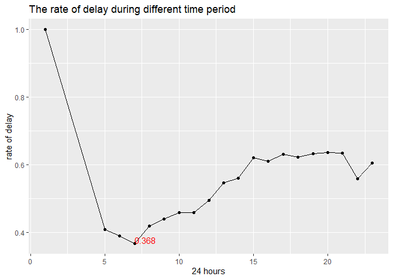
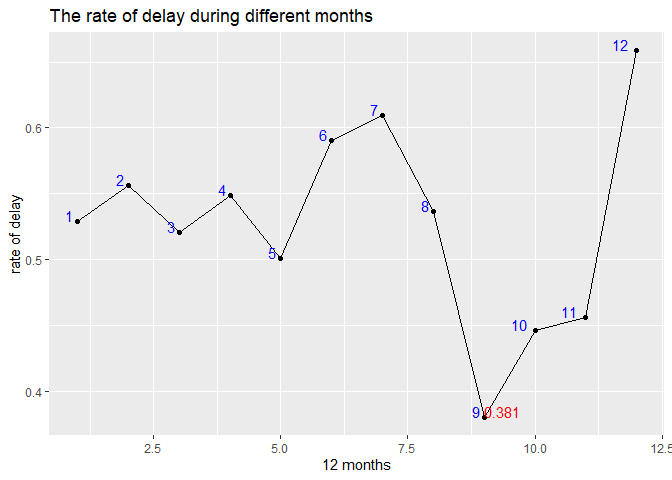
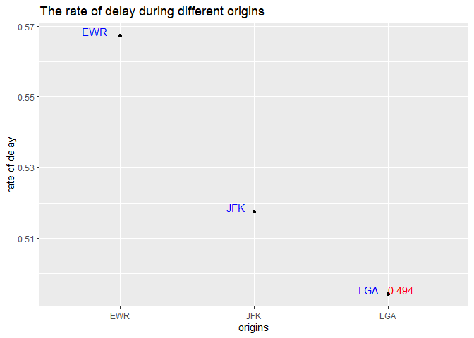
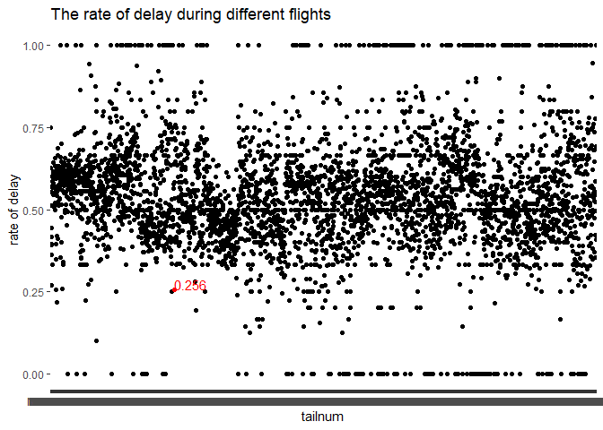
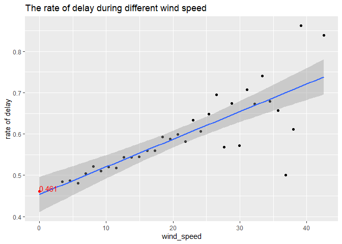

hw2
================
2022-10-11

## [My Github](https://github.com/jlyu37/stat433_HW2)

## What time of day should you fly if you want to avoid delays as much as possible?

> Around **7** am in the morning.  

> Around **September** during the whole year  

> Depart from **LGA**  

> Take **N363NB**

### by time of day

``` r
ques1 = flights %>% 
  left_join(weather) %>%
  mutate(adelay = if_else(condition = arr_delay > 0,
                                    true = T,
                                    false = F,
                                    missing = T),
         ddelay = if_else(condition = dep_delay > 0,
                                    true = T,
                                    false = F,
                                    missing = T),
         delay = adelay | ddelay)
```

    ## Joining, by = c("year", "month", "day", "origin", "hour", "time_hour")

``` r
by_hour = ques1 %>%
  group_by(hour) %>% 
  summarise(number = sum(delay), n = n(), delay_rate = number/n)

by_hour %>%
  arrange(delay_rate) %>%
  head(30)
```

    ## # A tibble: 20 × 4
    ##     hour number     n delay_rate
    ##    <dbl>  <int> <int>      <dbl>
    ##  1     7   8398 22821      0.368
    ##  2     6  10100 25951      0.389
    ##  3     5    800  1953      0.410
    ##  4     8  11400 27242      0.418
    ##  5     9   8926 20312      0.439
    ##  6    11   7348 16033      0.458
    ##  7    10   7677 16708      0.459
    ##  8    12   9007 18181      0.495
    ##  9    13  10923 19956      0.547
    ## 10    22   1476  2639      0.559
    ## 11    14  12171 21706      0.561
    ## 12    23    643  1061      0.606
    ## 13    16  14040 23002      0.610
    ## 14    15  14816 23888      0.620
    ## 15    18  13554 21783      0.622
    ## 16    17  15425 24426      0.631
    ## 17    19  13576 21441      0.633
    ## 18    21   6945 10933      0.635
    ## 19    20  10650 16739      0.636
    ## 20     1      1     1      1

``` r
by_hour %>%
  ggplot(aes(x = hour, y = delay_rate, label = delay_rate)) +
  geom_line() +
  geom_point() +
  geom_text(aes(label = ifelse(hour == 7, format(round(delay_rate, 3), nsmall = 3), '')),hjust=0, vjust=0, color = "red") +
  labs(title = "The rate of delay during different time period", x = "24 hours", y = "rate of delay")
```

<!-- -->

### by month of year

``` r
by_month = ques1 %>%
  group_by(month) %>% 
  summarise(number = sum(delay), n = n(), delay_rate = number/n)

by_month %>%
  arrange(delay_rate) %>%
  head(30)
```

    ## # A tibble: 12 × 4
    ##    month number     n delay_rate
    ##    <int>  <int> <int>      <dbl>
    ##  1     9  10495 27574      0.381
    ##  2    10  12903 28889      0.447
    ##  3    11  12443 27268      0.456
    ##  4     5  14432 28796      0.501
    ##  5     3  15017 28834      0.521
    ##  6     1  14293 27004      0.529
    ##  7     8  15737 29327      0.537
    ##  8     4  15538 28330      0.548
    ##  9     2  13878 24951      0.556
    ## 10     6  16673 28243      0.590
    ## 11     7  17941 29425      0.610
    ## 12    12  18526 28135      0.658

``` r
by_month %>%
  ggplot(aes(x = month, y = delay_rate, label = delay_rate)) +
  geom_line() +
  geom_point() +
  geom_text(aes(label = ifelse(month == 9, format(round(delay_rate, 3), nsmall = 3), '')),hjust=0, vjust=0, color = "red") +
  geom_text(aes(label = month),hjust=1.5, vjust=0, color = "blue") +
  labs(title = "The rate of delay during different months", x = "12 months", y = "rate of delay")
```

<!-- -->

``` r
by_month2 = ques1 %>%
  group_by(month, hour) %>% 
  summarise(number = sum(delay), n = n(), delay_rate = number/n)
```

    ## `summarise()` has grouped output by 'month'. You can override using the
    ## `.groups` argument.

``` r
by_month2 %>%
  arrange(delay_rate) %>%
  head(30)
```

    ## # A tibble: 30 × 5
    ## # Groups:   month [8]
    ##    month  hour number     n delay_rate
    ##    <int> <dbl>  <int> <int>      <dbl>
    ##  1     9     7    420  1895      0.222
    ##  2     9     6    457  2046      0.223
    ##  3     9     9    391  1546      0.253
    ##  4     9     8    661  2469      0.268
    ##  5     9     5     46   164      0.280
    ##  6    10     5     49   170      0.288
    ##  7    10     7    585  1953      0.300
    ##  8     5     6    702  2306      0.304
    ##  9     5     7    577  1887      0.306
    ## 10    10    22     57   184      0.310
    ## # … with 20 more rows

### by origin

``` r
by_origin = ques1 %>%
  group_by(origin) %>% 
  summarise(number = sum(delay), n = n(), delay_rate = number/n)

by_origin %>%
  arrange(delay_rate) %>%
  head(3)
```

    ## # A tibble: 3 × 4
    ##   origin number      n delay_rate
    ##   <chr>   <int>  <int>      <dbl>
    ## 1 LGA     51732 104662      0.494
    ## 2 JFK     57595 111279      0.518
    ## 3 EWR     68549 120835      0.567

``` r
by_origin %>%
  ggplot(aes(x = origin, y = delay_rate, label = delay_rate)) +
  geom_point() +
  geom_text(aes(label = ifelse(origin == "LGA", format(round(delay_rate, 3), nsmall = 3), '')),hjust=0, vjust=0, color = "red") +
  geom_text(aes(label = origin),hjust=1.5, vjust=0, color = "blue") +
  labs(title = "The rate of delay during different origins", x = "origins", y = "rate of delay")
```

<!-- -->

``` r
by_origin2 = ques1 %>%
  group_by(origin, hour) %>% 
  summarise(number = sum(delay), n = n(), delay_rate = number/n)
```

    ## `summarise()` has grouped output by 'origin'. You can override using the
    ## `.groups` argument.

``` r
by_origin2 %>%
  arrange(delay_rate) %>%
  head(30)
```

    ## # A tibble: 30 × 5
    ## # Groups:   origin [3]
    ##    origin  hour number     n delay_rate
    ##    <chr>  <dbl>  <int> <int>      <dbl>
    ##  1 LGA        7   2327  7137      0.326
    ##  2 JFK        7   2549  7026      0.363
    ##  3 LGA        6   3131  8558      0.366
    ##  4 LGA        8   2733  7167      0.381
    ##  5 LGA        9   3025  7760      0.390
    ##  6 EWR        5    350   895      0.391
    ##  7 JFK        6   2461  6260      0.393
    ##  8 JFK        5    296   750      0.395
    ##  9 JFK        8   4291 10780      0.398
    ## 10 EWR        6   4508 11133      0.405
    ## # … with 20 more rows

### by Tailnum

``` r
by_tailnum = ques1 %>%
  group_by(tailnum) %>% 
  summarise(number = sum(delay), n = n(), delay_rate = number/n)

med = mean(by_tailnum$n)
by_tailnum %>%
  filter(n > med) %>%
  arrange(delay_rate) %>%
  head(30)
```

    ## # A tibble: 30 × 4
    ##    tailnum number     n delay_rate
    ##    <chr>    <int> <int>      <dbl>
    ##  1 N363NB      22    86      0.256
    ##  2 N961UW      60   226      0.265
    ##  3 N952UW      76   282      0.270
    ##  4 N956UW      63   222      0.284
    ##  5 N963UW      65   219      0.297
    ##  6 N958UW      61   200      0.305
    ##  7 N951UW      81   265      0.306
    ##  8 N945UW      90   285      0.316
    ##  9 N304DQ      43   136      0.316
    ## 10 N967UW      66   208      0.317
    ## # … with 20 more rows

``` r
by_tailnum %>%
  ggplot(aes(x = tailnum, y = delay_rate, label = delay_rate)) +
  geom_point() +
  geom_text(aes(label = ifelse(tailnum == "N363NB", format(round(delay_rate, 3), nsmall = 3), '')),hjust=0, vjust=0, color = "red") +
  geom_point(aes(x = "N363NB", y = 0.2558140),colour="red") +
  labs(title = "The rate of delay during different flights", x = "tailnum", y = "rate of delay")
```

    ## Warning: Removed 1 rows containing missing values (geom_text).

<!-- -->

``` r
by_tailnum2 = ques1 %>%
  group_by(tailnum, hour) %>% 
  summarise(number = sum(delay), n = n(), delay_rate = number/n)
```

    ## `summarise()` has grouped output by 'tailnum'. You can override using the
    ## `.groups` argument.

``` r
by_tailnum2 %>%
  filter(n > 10 & !is.na(tailnum)) %>%
  arrange(delay_rate) %>%
  head(30)
```

    ## # A tibble: 30 × 5
    ## # Groups:   tailnum [30]
    ##    tailnum  hour number     n delay_rate
    ##    <chr>   <dbl>  <int> <int>      <dbl>
    ##  1 N156UW      6      0    11          0
    ##  2 N15985      6      0    12          0
    ##  3 N19130     11      0    11          0
    ##  4 N316NB      6      0    13          0
    ##  5 N369NB      7      0    13          0
    ##  6 N454AA      7      0    13          0
    ##  7 N481UA      6      0    11          0
    ##  8 N613JB     10      0    12          0
    ##  9 N717TW     10      0    15          0
    ## 10 N723UW      6      0    11          0
    ## # … with 20 more rows

### by wind speed

``` r
by_wind_speed = ques1 %>%
  group_by(wind_speed) %>% 
  summarise(number = sum(delay), n = n(), delay_rate = number/n)

by_wind_speed %>%
  arrange(delay_rate) %>%
  head(30)
```

    ## # A tibble: 30 × 4
    ##    wind_speed number     n delay_rate
    ##         <dbl>  <int> <int>      <dbl>
    ##  1       0      5480 11885      0.461
    ##  2       5.75  10679 22189      0.481
    ##  3       3.45   5625 11604      0.485
    ##  4       4.60   8714 17883      0.487
    ##  5      36.8      16    32      0.5  
    ##  6       6.90  13190 26191      0.504
    ##  7       9.21  15530 30405      0.511
    ##  8      11.5   14408 27836      0.518
    ##  9      10.4   14141 27191      0.520
    ## 10       8.06  15143 29021      0.522
    ## # … with 20 more rows

``` r
by_wind_speed %>%
  ggplot(aes(x = wind_speed, y = delay_rate, label = delay_rate)) +
  geom_point() +
  geom_smooth(method=lm) +
  geom_text(aes(label = ifelse(wind_speed == 0  , format(round(delay_rate, 3), nsmall = 3), '')),hjust=0, vjust=0, color = "red") +
  geom_point(aes(x = 0, y = 0.4610854),colour="red") +
  labs(title = "The rate of delay during different wind speed", x = "wind_speed", y = "rate of delay")
```

    ## `geom_smooth()` using formula 'y ~ x'

    ## Warning: Removed 1 rows containing non-finite values (stat_smooth).

    ## Warning: Removed 1 rows containing missing values (geom_point).

    ## Warning: Removed 1 rows containing missing values (geom_text).

<!-- -->

``` r
by_wind_speed2 = ques1 %>%
  group_by(wind_speed, hour) %>% 
  summarise(number = sum(delay), n = n(), delay_rate = number/n)
```

    ## `summarise()` has grouped output by 'wind_speed'. You can override using the
    ## `.groups` argument.

``` r
by_wind_speed2 %>%
  filter(!is.na(wind_speed)) %>%
  arrange(delay_rate) %>%
  head(30)
```

    ## # A tibble: 30 × 5
    ## # Groups:   wind_speed [15]
    ##    wind_speed  hour number     n delay_rate
    ##         <dbl> <dbl>  <int> <int>      <dbl>
    ##  1       23.0     5      0     9      0    
    ##  2       31.1    20      0     7      0    
    ##  3       31.1    23      0     2      0    
    ##  4       29.9    15      2    16      0.125
    ##  5       29.9    18      1     8      0.125
    ##  6       25.3     5      1     5      0.2  
    ##  7       26.5     5      1     4      0.25 
    ##  8       17.3     7     83   301      0.276
    ##  9       25.3     7     29   102      0.284
    ## 10       24.2    22      4    14      0.286
    ## # … with 20 more rows
